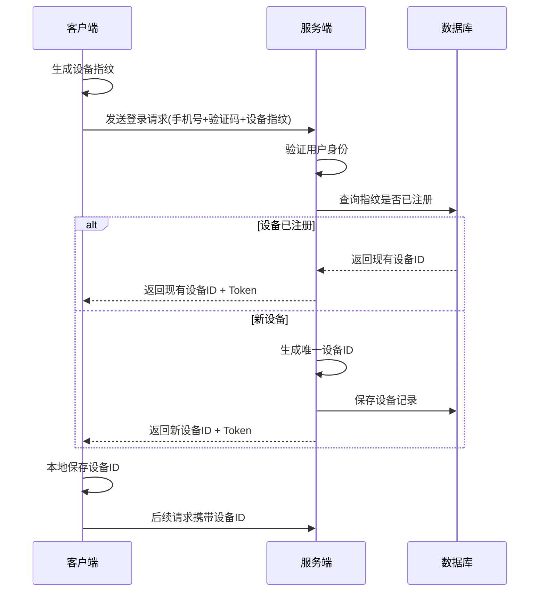

# 后端统一生成设备ID方案设计

## 🎯 **设计目标**

解决客户端生成设备ID的问题：
- ✅ **绝对的全局唯一性**
- ✅ **更高的安全性**
- ✅ **统一的管理策略**
- ✅ **更好的可追溯性**

## 🏗️ **架构设计**

### **核心理念：混合指纹 + 后端生成**
```
客户端设备指纹 + 后端唯一ID = 完美设备识别方案
```

### **工作流程**


## 📋 **数据模型设计**

### **1. 设备注册请求**
```go
type DeviceRegistrationRequest struct {
    DeviceFingerprint string `json:"device_fingerprint"` // 客户端生成的设备指纹
    DeviceType        string `json:"device_type"`        // 设备类型
    DeviceName        string `json:"device_name"`        // 设备名称
    AppVersion        string `json:"app_version"`        // 应用版本
    OSVersion         string `json:"os_version"`         // 系统版本
    Platform          string `json:"platform"`           // 平台信息
}
```

### **2. 设备注册响应**
```go
type DeviceRegistrationResponse struct {
    DeviceID  string    `json:"device_id"`  // 服务端生成的唯一设备ID
    IsNew     bool      `json:"is_new"`     // 是否为新注册设备
    ExpiresAt time.Time `json:"expires_at"` // 设备过期时间
}
```

### **3. 设备指纹记录**
```go
type DeviceFingerprint struct {
    Fingerprint       string    // 设备指纹（唯一）
    DeviceID          string    // 关联的设备ID
    UserID            uint      // 用户ID
    FirstSeenAt       time.Time // 首次见到时间
    LastSeenAt        time.Time // 最后见到时间
    RegistrationCount int       // 注册次数（检测异常）
}
```

## 🔧 **设备ID生成策略**

### **生成规则**
```
设备ID = 前缀 + 时间戳 + 用户ID哈希 + 随机数 + 指纹摘要 + 校验和
```

### **不同平台的ID格式**
```go
iOS:         "ios_67890abc123def456789abcdef123456"  // 32字符
Android:     "and_67890abc123def456789abcdef123456"  // 32字符  
PC:          "pc_67890abc123def456789abcdef123456"   // 32字符
Web:         "web_67890abc123def456789abcdef123456"  // 32字符
小程序:       "mp_67890abc123def456789abcdef123456"   // 32字符
```

### **ID组成部分解析**
| 部分 | 长度 | 示例 | 说明 |
|------|------|------|------|
| 前缀 | 4字符 | `ios_` | 设备类型标识 |
| 时间戳 | 8字符 | `67890abc` | 十六进制时间戳 |
| 用户ID哈希 | 6字符 | `123def` | 加盐哈希的用户ID |
| 随机数 | 8字符 | `456789ab` | 加密随机数 |
| 指纹摘要 | 8字符 | `cdef1234` | 设备指纹SHA256摘要 |
| 校验和 | 4字符 | `5678` | 整体校验和 |

## 🔒 **安全特性**

### **1. 防伪造机制**
- ✅ 服务端生成，客户端无法伪造
- ✅ 包含加密随机数，无法预测
- ✅ 校验和保证数据完整性

### **2. 防冲突机制**  
- ✅ 时间戳确保时序唯一性
- ✅ 随机数确保同时生成的唯一性
- ✅ 数据库唯一约束确保存储唯一性

### **3. 隐私保护**
- ✅ 用户ID使用加盐哈希，不可逆
- ✅ 设备指纹不包含敏感信息
- ✅ 所有信息都经过哈希处理

## 💻 **客户端指纹生成策略**

### **移动端（iOS/Android）**
```javascript
// 基于设备特征生成指纹
const fingerprint = sha256([
    deviceType,           // 设备类型
    platform,            // 系统平台
    osVersion,           // 系统版本
    appVersion,          // 应用版本
    screenResolution,    // 屏幕分辨率
    timeZone,           // 时区
    language,           // 语言设置
    dayFactor           // 按天变化因子
].join('|'));
```

### **Web端**
```javascript
// 基于浏览器特征生成指纹
function generateFingerprint() {
    const features = [
        navigator.userAgent,
        navigator.language,
        screen.width + 'x' + screen.height,
        new Date().getTimezoneOffset(),
        navigator.platform,
        navigator.cookieEnabled,
        localStorage ? 'localStorage' : '',
        sessionStorage ? 'sessionStorage' : ''
    ];
    
    return sha256(features.join('|'));
}
```

### **PC端**
```go
// 基于系统特征生成指纹
func generateFingerprint() string {
    features := []string{
        runtime.GOOS,        // 操作系统
        runtime.GOARCH,      // 架构
        getHostname(),       // 主机名
        getMACAddress(),     // MAC地址
        getSystemInfo(),     // 系统信息
        getAppVersion(),     // 应用版本
    }
    
    combined := strings.Join(features, "|")
    hash := sha256.Sum256([]byte(combined))
    return hex.EncodeToString(hash[:])
}
```

## 🔄 **API接口设计**

### **1. 设备注册接口**
```http
POST /api/v1/device/register
Content-Type: application/json

{
    "device_fingerprint": "a1b2c3d4e5f6...",
    "device_type": "ios",
    "device_name": "iPhone 15 Pro",
    "app_version": "1.0.0",
    "os_version": "iOS 17.0",
    "platform": "mobile"
}

Response:
{
    "code": 200,
    "data": {
        "device_id": "ios_67890abc123def456789abcdef123456",
        "is_new": true,
        "expires_at": "2025-12-31T23:59:59Z"
    }
}
```

### **2. 增强的登录接口**
```http
POST /api/v1/auth/login/v2
Content-Type: application/json

{
    "phone": "13800138000",
    "code": "123456",
    "device_info": {
        "device_fingerprint": "a1b2c3d4e5f6...",
        "device_type": "ios",
        "device_name": "iPhone 15 Pro",
        "app_version": "1.0.0",
        "os_version": "iOS 17.0"
    },
    "existing_device_id": "ios_67890abc123def456789abcdef123456" // 可选
}

Response:
{
    "code": 200,
    "data": {
        "access_token": "eyJ0eXAiOiJKV1QiLCJhbGciOiJIUzI1NiJ9...",
        "refresh_token": "eyJ0eXAiOiJKV1QiLCJhbGciOiJIUzI1NiJ9...",
        "expires_in": 86400,
        "token_type": "Bearer",
        "device_id": "ios_67890abc123def456789abcdef123456",
        "device_registration": {
            "is_new": false,
            "expires_at": "2025-12-31T23:59:59Z"
        },
        "user": {
            "id": 1,
            "phone": "13800138000"
        }
    }
}
```

## 🔀 **迁移策略**

### **阶段1：并行运行（2周）**
- 保持现有客户端生成方案
- 新增服务端生成接口
- 客户端可选择使用新方案

### **阶段2：逐步切换（4周）**
- 新版本客户端使用服务端生成方案
- 老版本客户端继续使用现有方案  
- 监控两种方案的运行情况

### **阶段3：完全切换（2周）**
- 强制升级客户端
- 停用客户端生成方案
- 清理旧版本兼容代码

### **数据迁移脚本**
```sql
-- 1. 备份现有设备数据
CREATE TABLE user_devices_backup AS SELECT * FROM user_devices;

-- 2. 为现有设备生成服务端ID
UPDATE user_devices SET 
    device_id = CONCAT('legacy_', LEFT(MD5(CONCAT(user_id, device_id, created_at)), 24))
WHERE device_id NOT REGEXP '^(ios_|and_|pc_|web_|mp_)';

-- 3. 添加迁移标记
ALTER TABLE user_devices ADD COLUMN is_legacy BOOLEAN DEFAULT FALSE;
UPDATE user_devices SET is_legacy = TRUE WHERE device_id LIKE 'legacy_%';
```

## 📊 **优势对比**

| 特性 | 客户端生成 | 服务端生成 | 改进度 |
|------|------------|------------|--------|
| 全局唯一性 | ❌ 无法保证 | ✅ 绝对保证 | 100% |
| 安全性 | ❌ 可被伪造 | ✅ 无法伪造 | 100% |
| 管理复杂度 | ❌ 复杂 | ✅ 简单 | 80% |
| 离线可用性 | ✅ 支持 | ❌ 需网络 | -20% |
| 服务器压力 | ✅ 无压力 | ❌ 略增加 | -10% |
| 调试便利性 | ❌ 困难 | ✅ 便利 | 90% |
| 冲突处理 | ❌ 复杂 | ✅ 无需处理 | 100% |

## 🚀 **实施建议**

### **立即实施**
1. ✅ 已完成后端生成服务设计
2. ⏳ 创建数据库迁移脚本
3. ⏳ 实现新的登录接口
4. ⏳ 更新客户端SDK

### **分步实施**
1. **Week 1-2**: 后端接口开发和测试
2. **Week 3-4**: 客户端SDK开发
3. **Week 5-6**: 内测和压力测试
4. **Week 7-8**: 灰度发布
5. **Week 9-10**: 全量发布
6. **Week 11-12**: 清理和优化

### **风险控制**
- 🔒 保留回滚机制
- 📊 实时监控系统性能
- 🚨 异常情况自动降级
- 📝 详细的操作日志

## 🎉 **总结**

**后端统一生成设备ID方案**是一个更加安全、可靠、易管理的解决方案。虽然增加了一些复杂性，但带来的安全性和管理便利性提升是巨大的。

**核心优势：**
- 🛡️ **安全性**: 无法伪造，杜绝恶意攻击
- 🎯 **唯一性**: 绝对全局唯一，零冲突
- 🔧 **可控性**: 统一管理，便于维护
- 📈 **可扩展性**: 易于添加新特性

这个方案将为整个设备管理系统奠定坚实的基础！ 