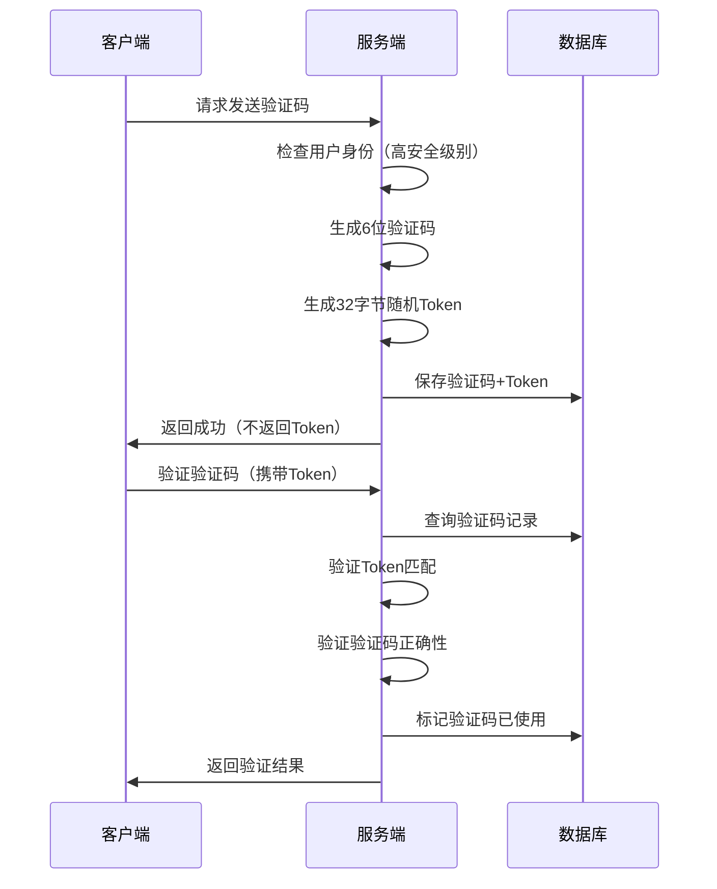

# 短信验证码安全设计文档

## 🎯 **设计目标**

从安全角度和企业级最佳实践考虑，为验证码系统提供：
- ✅ **唯一Token机制** - 防止验证码重放攻击
- ✅ **分级安全策略** - 不同操作需要不同级别的身份验证
- ✅ **用户身份验证** - 高安全级别操作需要用户登录
- ✅ **完整审计日志** - 记录所有验证码操作

## 🏗️ **架构设计**

### **安全级别分类**

#### **低安全级别（无需登录）**
- `login` - 登录验证
- `register` - 注册验证
- `reset` - 重置密码

#### **高安全级别（需要登录）**
- `change` - 变更个人信息
- `payment` - 支付验证
- `withdraw` - 提现验证
- `security` - 安全设置变更
- `device` - 设备绑定

### **Token机制设计**



## 🔒 **安全特性**

### **1. 唯一Token机制**
```go
// 每个验证码都有唯一的32字节Token
type SMSVerificationCode struct {
    Token string `gorm:"type:varchar(64);not null;uniqueIndex"`
    // ... 其他字段
}

// 生成Token
func (s *SMSVerificationCode) GenerateToken() error {
    bytes := make([]byte, 32)
    if _, err := rand.Read(bytes); err != nil {
        return err
    }
    s.Token = hex.EncodeToString(bytes)
    return nil
}
```

### **2. 分级安全策略**
```go
// 高安全级别操作需要用户登录
func IsHighSecurityPurpose(purpose string) bool {
    highSecurityPurposes := []string{
        "change",    // 变更个人信息
        "payment",   // 支付验证
        "withdraw",  // 提现验证
        "security",  // 安全设置变更
    }
    
    for _, p := range highSecurityPurposes {
        if p == purpose {
            return true
        }
    }
    return false
}
```

### **3. 用户身份验证**
```go
// 发送验证码时检查用户身份
func (s *smsService) SendVerificationCode(req *model.SendSMSRequest, clientIP, userAgent string, userID *uint) error {
    // 高安全级别操作需要用户身份验证
    if model.IsHighSecurityPurpose(req.Purpose) {
        if userID == nil {
            return errors.New("高安全级别操作需要用户登录")
        }
    }
    // ... 其他逻辑
}
```

### **4. Token验证机制**
```go
// 验证时检查Token
func (s *smsService) ValidateVerificationCode(phone, code, purpose, token string) error {
    // ... 获取验证码记录
    
    // 验证token（如果提供）
    if token != "" && smsCode.Token != token {
        logger.Warn("验证码token不匹配", map[string]any{
            "phone":   phone,
            "purpose": purpose,
            "ip":      smsCode.ClientIP,
        })
        return errors.New("验证码token无效")
    }
    
    // ... 其他验证逻辑
}
```

## 📊 **数据库设计**

### **表结构升级**
```sql
-- 添加Token和UserAgent字段
ALTER TABLE sms_verification_codes 
ADD COLUMN token VARCHAR(64) NOT NULL DEFAULT '' COMMENT '唯一验证token';

ALTER TABLE sms_verification_codes 
ADD COLUMN user_agent VARCHAR(500) DEFAULT NULL COMMENT '用户代理';

-- 添加索引
ALTER TABLE sms_verification_codes 
ADD UNIQUE INDEX idx_token (token);

ALTER TABLE sms_verification_codes 
ADD INDEX idx_purpose (purpose);
```

### **审计视图**
```sql
-- 验证码安全审计视图
CREATE VIEW sms_security_audit AS
SELECT 
    id, phone, purpose, client_ip, user_agent,
    created_at, expired_at, used_at,
    CASE 
        WHEN used_at IS NOT NULL THEN 'used'
        WHEN expired_at < NOW() THEN 'expired'
        ELSE 'valid'
    END as status
FROM sms_verification_codes
ORDER BY created_at DESC;
```

## 🚀 **API接口设计**

### **发送验证码**
```http
POST /api/v1/sms/send
Content-Type: application/json
Authorization: Bearer <token>  # 高安全级别操作需要

{
    "phone": "13800138000",
    "purpose": "payment"  # 高安全级别
}
```

### **验证验证码**
```http
POST /api/v1/sms/validate
Content-Type: application/json

{
    "phone": "13800138000",
    "code": "123456",
    "purpose": "payment",
    "token": "abc123..."  # 可选，增强安全性
}
```

## 🔍 **安全监控**

### **异常检测**
1. **Token不匹配** - 可能的重放攻击
2. **高频率请求** - 可能的暴力破解
3. **IP异常** - 可能的代理攻击
4. **用户代理异常** - 可能的自动化攻击

### **审计日志**
```go
// 记录所有验证码操作
logger.Info("短信发送成功", map[string]any{
    "phone":     phone,
    "purpose":   purpose,
    "client_ip": clientIP,
    "user_id":   userID,  // 高安全级别操作
    "timestamp": time.Now().Unix(),
})
```

## 📋 **最佳实践**

### **客户端实现**
1. **不要存储Token** - Token应该由服务端管理
2. **HTTPS传输** - 所有验证码相关请求必须使用HTTPS
3. **输入验证** - 客户端也要验证手机号格式
4. **错误处理** - 优雅处理验证失败

### **服务端实现**
1. **频率限制** - 防止验证码轰炸
2. **IP白名单** - 生产环境IP限制
3. **日志记录** - 完整的安全审计
4. **监控告警** - 异常行为告警

### **数据库安全**
1. **字段加密** - 敏感字段加密存储
2. **访问控制** - 数据库访问权限控制
3. **备份策略** - 定期备份验证码数据
4. **清理策略** - 定期清理过期验证码

## 🎯 **安全收益**

### **防止的攻击类型**
- ✅ **重放攻击** - Token机制防止
- ✅ **暴力破解** - 频率限制防止
- ✅ **身份伪造** - 用户身份验证防止
- ✅ **会话劫持** - Token验证防止

### **合规要求**
- ✅ **数据保护** - 用户隐私保护
- ✅ **审计要求** - 完整操作日志
- ✅ **访问控制** - 分级权限管理
- ✅ **监控告警** - 异常行为检测 